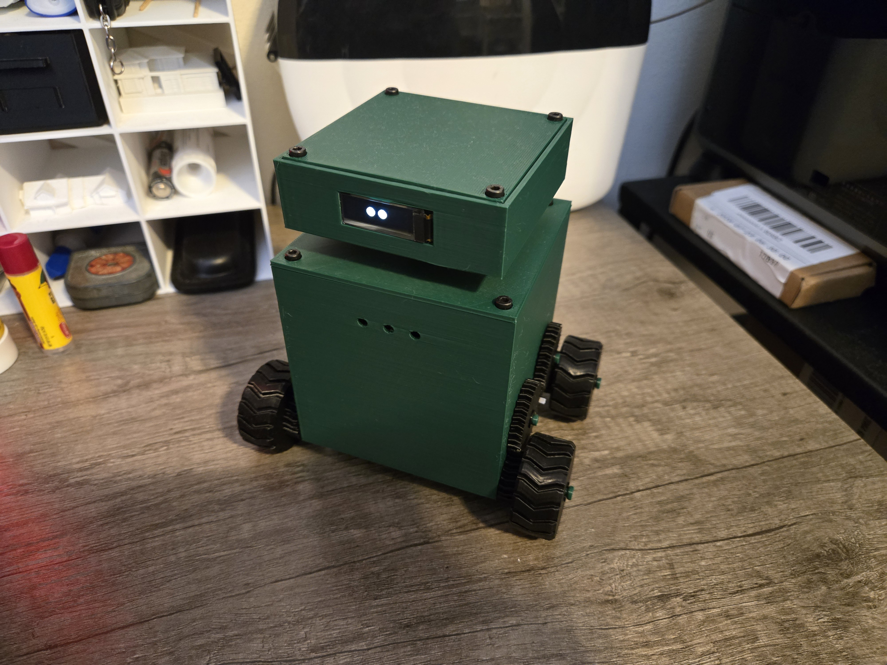
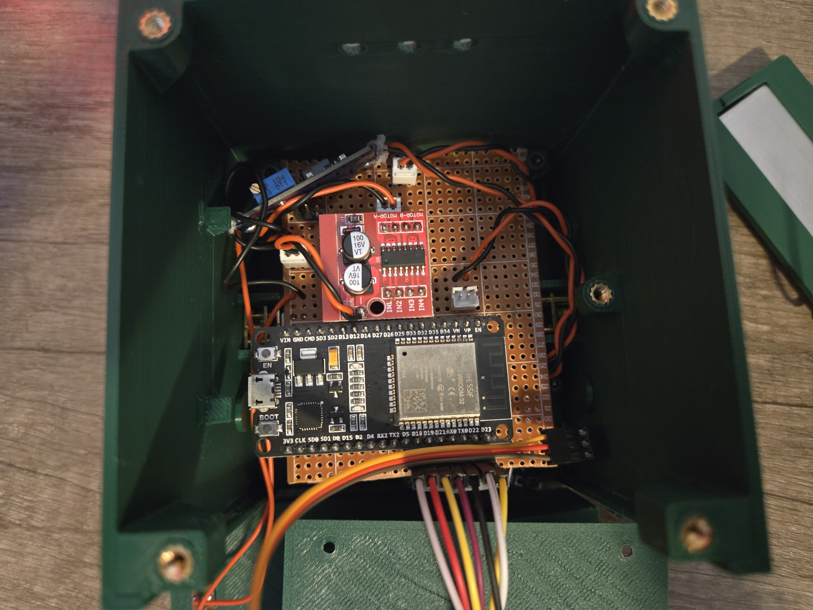
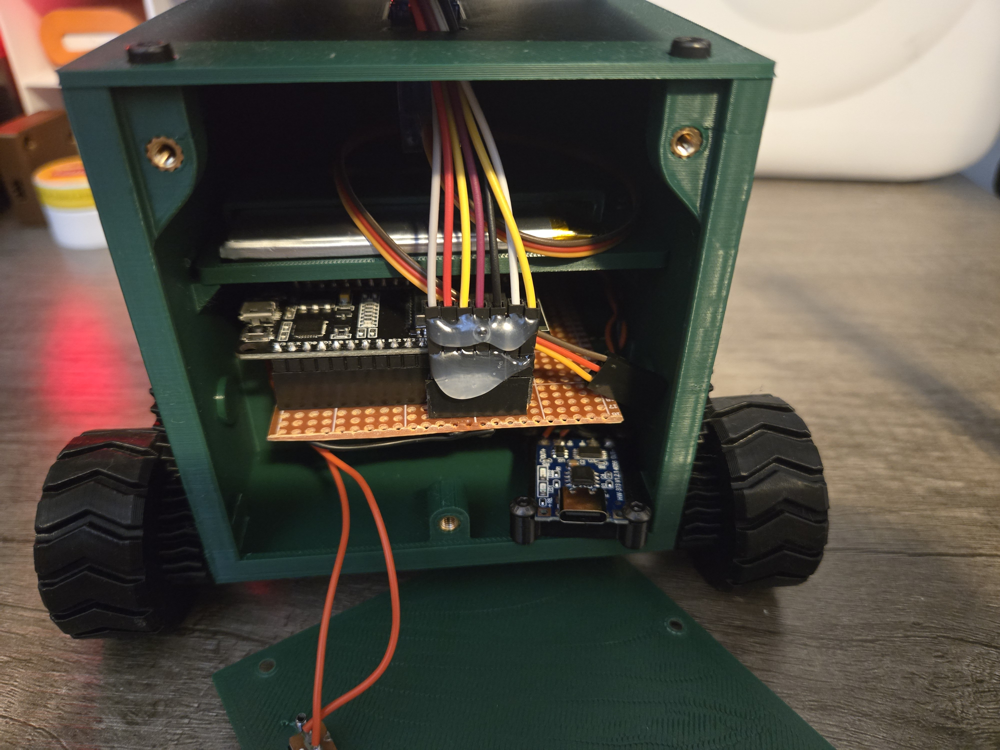
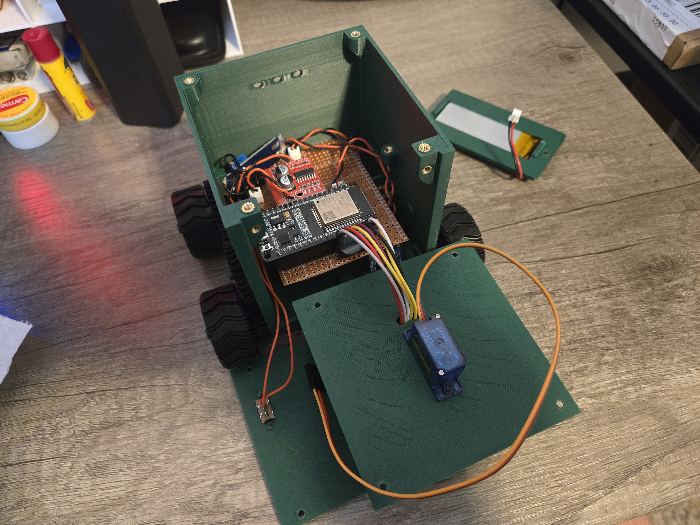

# MyRobot

## Table of Contents
1. [Introduction](#introduction)
2. [To-Do List](#todo-list)
3. [Dependencies](#dependencies)
4. [Control Modes](#control-modes)
5. [Hardware Requirements](#hardware-requirements)
    - [Microcontroller](#microcontroller)
    - [Motors](#motors)
    - [User Interface](#user-interface)
    - [Power Train](#power-train)
    - [Body](#myrobot-body)

ESP32 Companion Robot, structured around a ESP32-WROOM-32 Development Kit. I built this project as an opportunity to continue using skills obtained through school, and as a potential resume-supporting item.

### See Also
[Custom PCB Design](github.com/VinFan0/MyRobot_PCB)

## To-Do List
- Replace high-torque drive motors
- Troubleshoot servo "sticking" while turning
- Get video of operation
- Wire up status LEDs
- Write status LED code
- Design V2 body 
+ USB-C Charging port access
- Implement working advanced controls

## Dependency Libraries
The following libraries must be installed in order to build the project:
* BluetoothSerial
* SPI
* math
* Adafruit\_GFX
* Adafruit\_SSD1306
* ESP32Servo

## Control Modes
MyRobot is controlled via Bluetooth with the BT Car Controller-Arduino/ESP mobile application, available from the [Google Play Store](https://play.google.com/store/apps/details?id=com.giristuido.bluetooth.car.controller&hl=en_US). The application offers both **Basic** and **Advanced** control modes. 

**Basic** mode consists of 4 main buttons for control: Forward, Backward, Right, Left. Pressing a button, or a valid combination, sends a single, corresponding, character over bluetooth.

The MyRobot\_Basic\_Control branch will be built to allow the basic mode controls. 

**Advanced** mode provides two joy-stick style controls. One provides a spectrum for forward and reverse, while the other controls right and left. When a stick is moved to a location, 6 individual characters are sent in the following pattern.

- Throttle Character ('F' or 'B')
- Throttle value tens digit
- Throttle value ones digit
- Direction character ('R' or 'B')
- Direction value tens digit
- Direction value ones digit

As an example, if the throttle stick is set to forward with a magnitude of 50, and the direction stick is on left with magnitude 10, the series of Bluetooth characters will be `F 5 0 L 1 0`.

The MyRobot\_Advanced\_Control branch will be built to allow the advanced mode controls.

## Hardware Requirements

The first revision (V1) of MyRobot is built using perfboard, wires, and separate breakout boards for each hardware peripheral. For V2, I've developed a custom PCB. The PCB implements the same features of battery charging/protection, multiple voltage levels, and interface for connecting the peripherals. The PCB design can be found in a separate GitHub repository: [MyRobot\_PCB](github.com/VinFan0/MyRobot_PCB).

### Microcontroller
I used a [DOIT ESP32 DevKit V1](https://embedded-systems-design.github.io/overview-of-the-esp32-devkit-doit-v1/) for the MyRobot project. This decision was driven primarily by how many pins would be required to connect each of the peripherals. The project is not incredibly intensive on storage, so no additional flash should be required.

All current versions of MyRobot utilize the same developement board. This is to retain easy access to the microcontroller for development and troubleshooting as the board connects via header pins instead of being soldered to the PCB.

### Motors
MyRobot utilizes 2, 2700 RPM, DC motors for drive control, and a servo motor for head movement.
- DC Motors
+ [RF-500TB-18280 Mini DC Motor](https://www.amazon.com/RF-500TB-18280-Electric-1-5V-5V-2700RPM-Diameter/dp/B09N2PPWCW?th=1)
+ 1.5V-5V, 2700RPM.
- Servo
+ [DFROBOT DS-S006L](https://www.dfrobot.com/product-2120.html)
+ 9g, 180&deg;

### User Interface
- [Android BT Car Controller](https://play.google.com/store/search?q=bt%20car%20controller&c=apps&hl=en_US)
- [Digilent PMOD OLED Module](https://digilent.com/reference/pmod/pmodoled/start)
+ SSD1306 primary IC
+ 128x32 pixels
+ SPI
- *TODO* LEDs
+ Three 3mm colored LEDs to provide status information

### Power Train
**(REV 1, Pre Custom PCB)**
- [1S 2000mAh LiPo battery](https://www.amazon.com/Winfox-Rechargeable-Connector-Bluetooth-Portable/dp/B0GDQ7Q58F)
- [HiLetgo TP4056 LiPo Charger Module](https://www.amazon.com/dp/B07PKND8KG)
- [Ferwooh MT3608 Variable Boost Converter](https://www.amazon.com/dp/B0D17PHDSD)
*Breakout boards used in the power train are replaced with respective ICs on the PCB*

### MyRobot Body
MyRobot is housed in a 3D printed enclosure. The body utilizes M3x6 screws and heat-set inserts to hold everything in place (The servo motor has smaller M2 screws connecting the servo horn to the head enclosure). The body includes spaces to hold the electronics and drive-gear assemblies in place. 

Access to the USB-C battery charging port was neglected in V1 of the body, so the back panel must be removed to charge the battery.

The top and bottom panels can both be removed for easy access to the electronics.

All photos and videos obtained during the making of MyRobot can be found under `docs/images/`.
